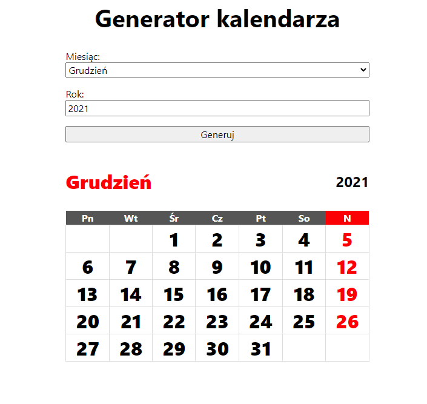

# Zadanie 1
Przyjmijmy, że dni zaczynają się od poniedziałku, a niedziele są oznaczone kolorem czerwonym.
Twoim zadaniem jest napisanie metody, która umożliwi wygenerowanie w html takiej kartki z
kalendarza dla dowolnie podanego miesiąca i roku.

## Rozwiązanie zadania
[Rozwiązanie](index.php)

