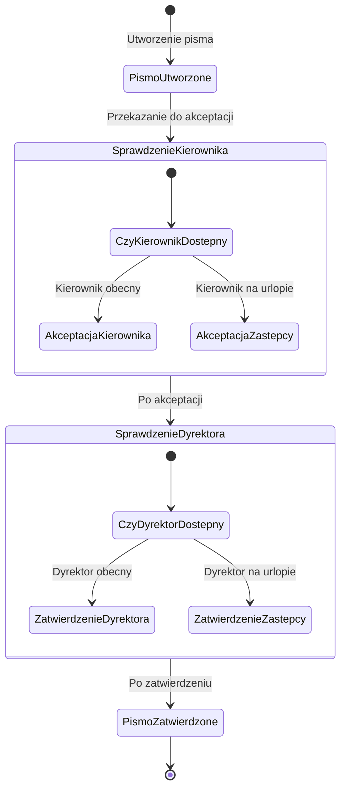

# Zadanie 5

Uczestniczysz w realizacji projektu IT, który obejmuje takie obszary jak: obieg pism przychodzących i
wychodzących, płatności oraz obieg wniosków o urlop.
Zgodnie z wymaganiami funkcjonalnymi otrzymanymi od Kierownika Projektu, konieczne jest
oprogramowanie obiegu pisma wychodzącego w następujący sposób: Pismo wychodzące powinno
być zawsze przesłane do akceptacjiprzezKierownika oraz przesłane do zatwierdzeniaprzez Dyrektora.
W programie powinien zostać uwzględniony mechanizm zastępstw, czyli w przypadku, gdy pracownik
jest w firmie powinien mieć możliwość akceptacji dokumentu samodzielnie, a gdy przebywa na
urlopie dokument powinien móc zaakceptować zastępca. Analogiczna sytuacja powinna zostać
oprogramowana w przypadku zatwierdzenia. Twoim zadaniem jest:
1. wyszczególnienie aktorów uczestniczących w procesie obiegu pisma wychodzącego
2. zamodelowanie obiegu dokumentu, np. za pomocą BPMN lub napisanie fragmentu kodu
wykorzystując język PHP,
3. zaproponowanie fragmentu bazy danych, w którym byłaby możliwość odnotowania
faktu zastępstwa.

## Wyszczególnienie aktorów
- Pracownik
- Kierownik
- Zastępca Kierownika
- Dyrektor
- Zastępca Dyrektora

## Diagram obiegu dokumentów

## Schemat bazy danych

[Schemat bazy danych](db.sql)